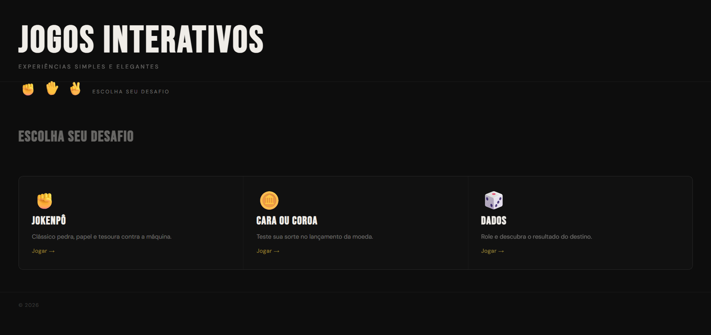
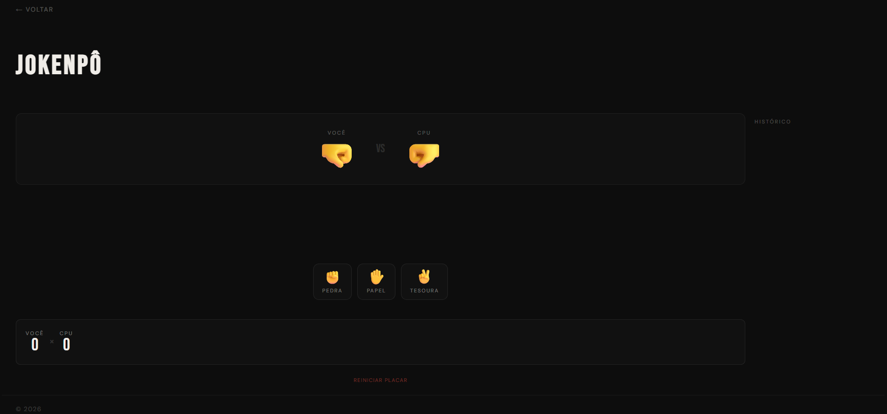
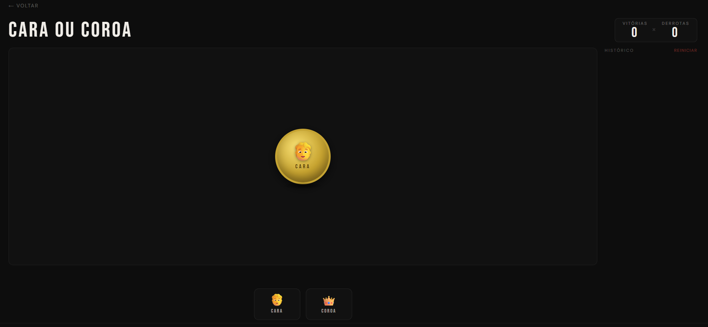
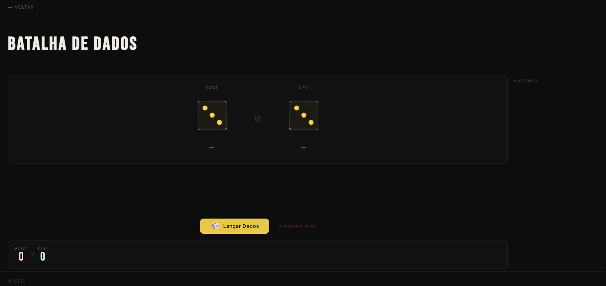
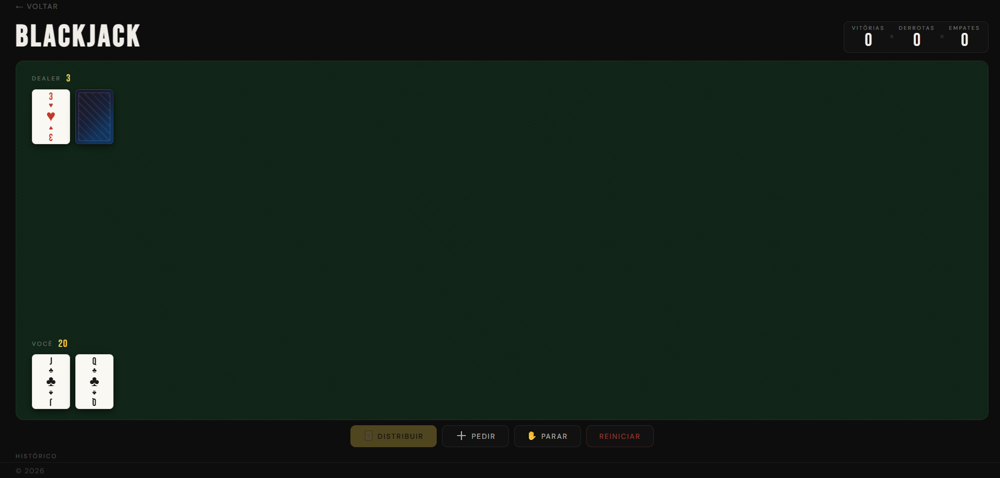

# Arcade JS - Portal de Jogos Clássicos

**Colégio ULBRA São Lucas - Curso Técnico em Informática** **Projeto desenvolvido para o módulo de Lógica e Programação Web**

---

## Sobre o Projeto
Este portal é uma coleção de jogos clássicos desenvolvidos em ambiente web para exercitar a lógica de programação e a manipulação dinâmica de elementos da página sem a necessidade de recarregamento (Single Page Application feel).

### Jogos Disponíveis
* **Jokenpô (Pedra, Papel ou Tesoura)**: Desafio de estratégia contra a Inteligência Artificial.
* **Batalha de Dados**: Um teste de sorte pura onde vence quem tirar o maior número no dado.
* **Cara ou Coroa**: Escolha entre cara ou coroa e veja se o sorteio do sistema coincide com a sua aposta.
* **BlackJack**: Chegue ao 21 sem estourar. Vença o dealer.
---

## Requisitos Técnicos Atendidos
* **Lógica e Estrutura**: Uso de `Math.random()` e `Math.floor()` para as decisões da IA e geração de resultados aleatórios.
* **Manipulação do DOM**: Atualização de textos, emojis e placares em tempo real através de `document.querySelector` ou `document.getElementById`.
* **Interface Dinâmica**: O feedback de vitória, derrota ou empate é exibido instantaneamente no ecrã sem o uso de alertas (`alert()`).
* **Modularização**: Código organizado em funções independentes para cada lógica de jogo e atualização de placar.
* **Responsividade**: Layout adaptado para ser jogável tanto em computadores como em dispositivos móveis.

---

## Tecnologias Utilizadas
* **HTML5**: Estruturação semântica e botões de ação.
* **CSS3**: Estilização visual moderna, uso de fontes externas e organização de layout.
* **JavaScript (ES6)**: Lógica de jogo, controlo de eventos de clique e manipulação de objetos/arrays.

---

## Como Jogar
1. Aceda ao portal através do ficheiro `index.html`.
2. Selecione o jogo desejado no menu principal.
3. Interaja com os botões de escolha (Pedra/Papel/Tesoura, Lançar Dados ou Cara/Coroa).
4. O resultado da rodada e o placar acumulado serão exibidos instantaneamente na interface.
5. Para reiniciar o progresso, utilize os botões de "Reiniciar" ou atualize o navegador.

---

## Demonstração Visual
: 
: 
: 
: 
: 
---

## Como Executar o Projeto
1. Faça o clone deste repositório:
   ```bash
   git clone [https://github.com/Kauaxz89/ProjetoDK.git](https://github.com/Kauaxz89/ProjetoDK.git)
2. Navegue até à pasta do projeto e abra o ficheiro index.html em qualquer navegador moderno.
